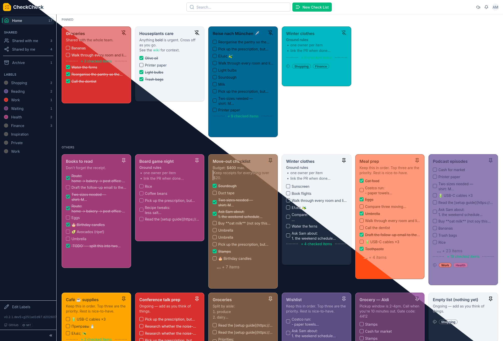

# CheckCheck

A collaborative, self-hostable, offline-capable checklist app. It ships as a
single container: a web UI backed by a REST API. Make lists, check things off,
organise with labels, and share individual cards with other people. Because it
is local-first, the app keeps working while you are offline and syncs back up
when the connection returns, and it installs as a PWA.

**Status: Beta.** Usable and self-hostable, but edges remain and
things can still change. See [Limitations](#limitations) before you rely on it.  
(I just started driving it in real life)



See more in the [screenshot gallery](docs/screenshots.md).

## Features

- **Checklists.** Make lists and check things off.
- **Drag and Drop**. Sort you cards and the items by drag and drop.
- **Markdown**. Card notes support Markdown.
- **Labels.** Organise cards with labels.
- **Sharing.** Share individual cards with other people and collaborate.
- **Real-time collaboration.** Shared cards update live across devices as
  people edit them.
- **Public share links.** Publish a card to a link (optionally
  passphrase-protected). Viewers need no account.
- **Offline-capable.** Local-first, so it keeps working while you are offline
  and syncs back up when the connection returns.
- **Installable PWA.** Add it to your device like a native app. See
  [docs/pwa-install.md](docs/pwa-install.md).
- **SSO / OpenID Connect.** Bring your own identity provider (Authentik,
  Keycloak, …).
- **Light & dark themes.** Follows your system, or pick one.
- **Self-hostable.** Ships as a single container: a web UI backed by a REST API.

## Run it (Docker)

The published image is [`motey/checkcheck`](https://hub.docker.com/r/motey/checkcheck).
It runs against PostgreSQL and needs three secrets from you: two long random
strings and the first admin password. Save this as `docker-compose.yml`:

```yaml
services:
  checkcheck:
    image: motey/checkcheck:latest
    restart: unless-stopped
    ports:
      - "8181:8181"
    depends_on:
      - db
    environment:
      SERVER_SESSION_SECRET: "replace-with-64+-random-chars"
      AUTH_JWT_SECRET: "replace-with-a-different-64+-random-string"
      ADMIN_USER_PW: "pick-a-strong-password"
      SQL_DATABASE_URL: "postgresql+asyncpg://checkcheck:secret@db:5432/checkcheck"
      SERVER_PUBLIC_URL: "http://localhost:8181"   # plain-HTTP localhost; see below

  db:
    image: postgres:16
    restart: unless-stopped
    environment:
      POSTGRES_USER: checkcheck
      POSTGRES_PASSWORD: secret
      POSTGRES_DB: checkcheck
    volumes:
      - checkcheck-db:/var/lib/postgresql/data

volumes:
  checkcheck-db:
```

Fill in the two secrets (`openssl rand -hex 32` gives you one each), run
`docker compose up -d`, then open <http://localhost:8181> and log in as `admin`
with the password you set.

`SERVER_PUBLIC_URL` is the external URL users reach the app on. Here it is
plain-HTTP localhost, which makes the session cookie non-Secure automatically so
login works. Behind an HTTPS reverse proxy, set it to your real URL
(`SERVER_PUBLIC_URL=https://your.domain`) — the cookie then becomes Secure on its
own. See [docs/deployment.md](docs/deployment.md) for the production setup and
reverse proxy notes.

## Configuration

Every setting can come from an environment variable or a mounted `config.yml`
(env wins). Two documents cover it:

- [docs/configuration.md](docs/configuration.md) is the readable introduction:
  the handful of things you must set and the common scenarios.
- [docs/CONFIG_REFERENCE.md](docs/CONFIG_REFERENCE.md) is the exhaustive,
  generated reference for every field, and [config.example.yml](config.example.yml)
  is a fillable template.

## Limitations

CheckCheck is young. Know these before deploying:

- **Not built for a large user base.** It targets personal use and small,
  trusted groups, running on PostgreSQL (see [docs/deployment.md](docs/deployment.md)).
- **User management is delegated to an identity provider.** Onboarding through
  an external OpenID Connect provider (Authentik, Keycloak, and so on) is the
  intended way to manage accounts. A single admin is bootstrapped from config,
  and optional self-registration exists (off by default). A built-in local
  user-management UI is not a goal right now but may come later.
- **No email verification for self-registration.** So it is off by default;
  enable it only on a trusted network or behind other anti-abuse controls, or
  use OIDC instead.
- **Some features require connectivity by design.** Sharing, invitations,
  notifications, and label create/rename/delete do not work offline and queue
  nothing while disconnected.
- **The offline snapshot is stored unencrypted on the device.** Treat shared or
  public machines accordingly.
- **Beta stability.** Expect bugs and occasional changes. Read
  [docs/UPGRADING.md](docs/UPGRADING.md) before upgrading and keep backups.

## Documentation

| Document | What it covers |
|---|---|
| [docs/configuration.md](docs/configuration.md) | Readable intro to configuring an instance: precedence, required secrets, common scenarios, OIDC. |
| [docs/CONFIG_REFERENCE.md](docs/CONFIG_REFERENCE.md) | Generated reference for every config field (type, default, env var, description). |
| [docs/deployment.md](docs/deployment.md) | Running with Docker and compose, PostgreSQL vs SQLite, reverse proxies, backups. |
| [docs/administration.md](docs/administration.md) | Day-to-day admin: the first admin, roles, adding users, sharing switches, the offline kill switch. |
| [docs/pwa-install.md](docs/pwa-install.md) | Installing CheckCheck as an app: per-platform user steps and the HTTPS/serving requirements admins must meet. |
| [docs/UPGRADING.md](docs/UPGRADING.md) | Per-release upgrade notes; pairs with [CHANGELOG.md](CHANGELOG.md). |
| [docs/SYNC_PROTOCOL.md](docs/SYNC_PROTOCOL.md) | The local-first delta-sync contract, for developers and integrators. |
| [docs/](docs/) | Everything else: testing guides, the known-issues log, and historical plans. |

## Building from source

See [docs/deployment.md](docs/deployment.md) for building the image yourself and
[CheckCheck/backend/README.md](CheckCheck/backend/README.md) /
[CheckCheck/frontend/README.md](CheckCheck/frontend/README.md) for the
component-level developer setup.


## Roadmap

Missing features, that i will integrate soon...

* Email notifications
* "Remind me on date"-feature

### Ideas

Maybe some day...

* Android native client

## License

MIT, see [LICENSE](LICENSE).
