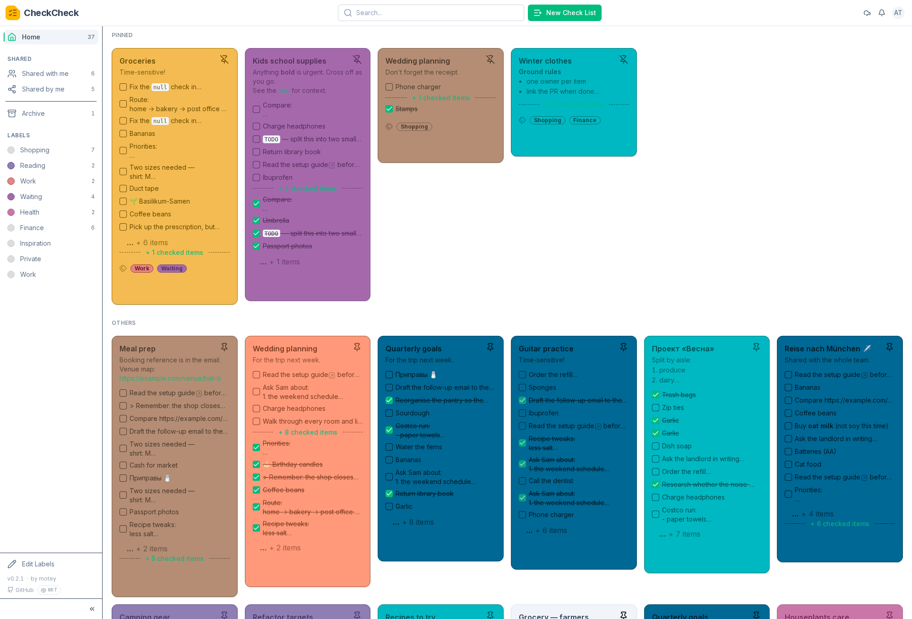
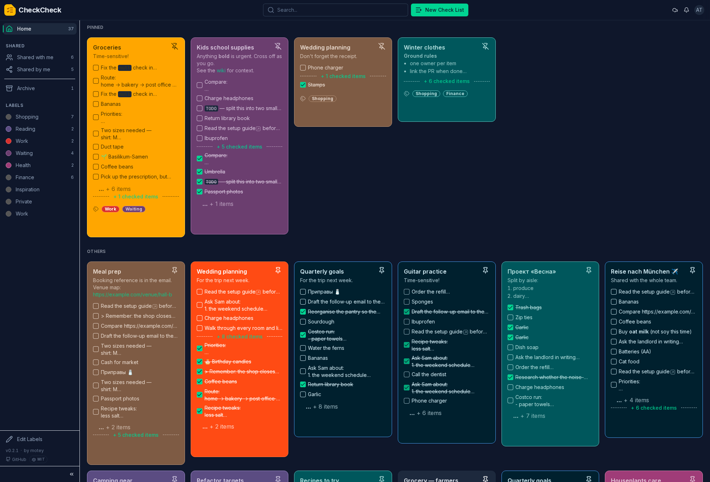
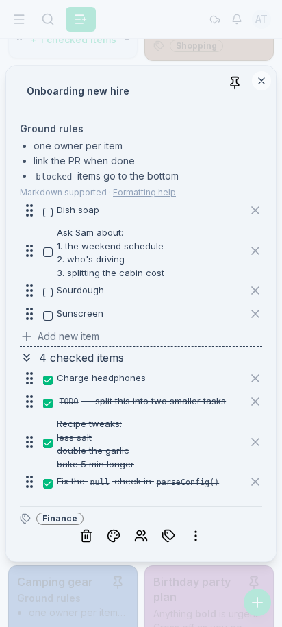
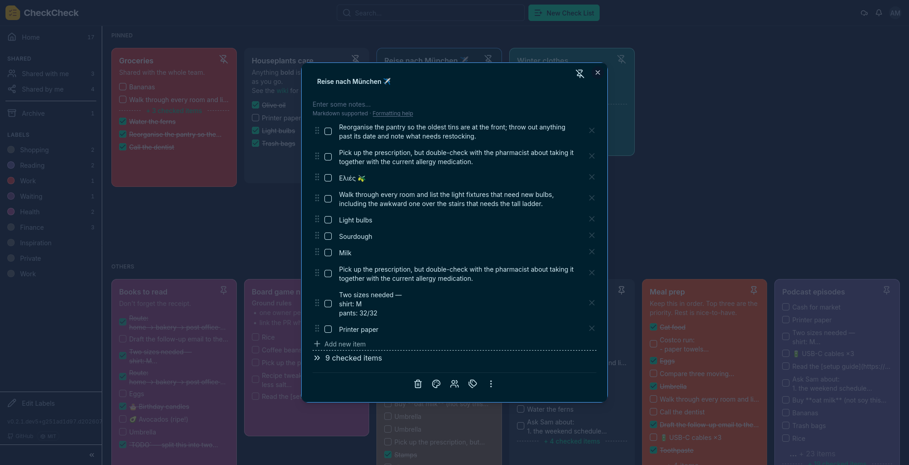
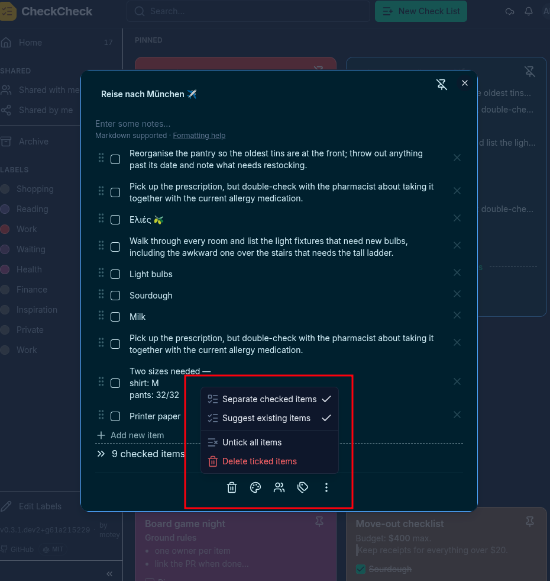
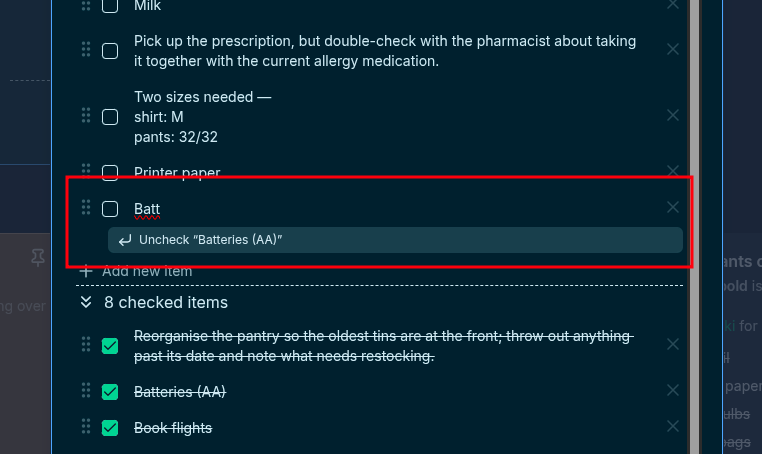
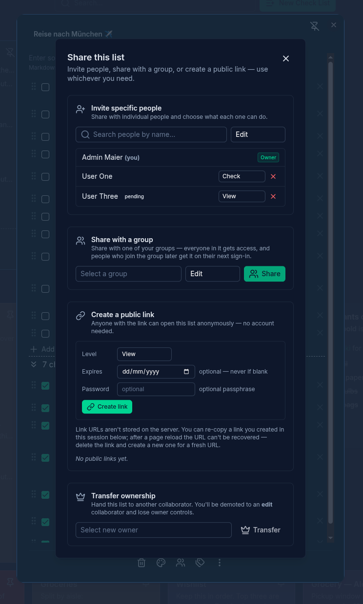
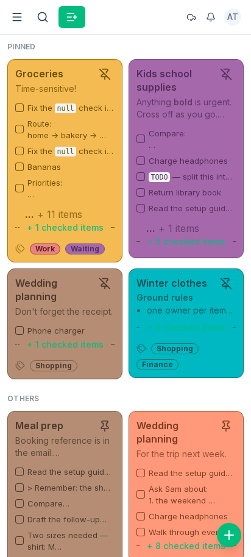
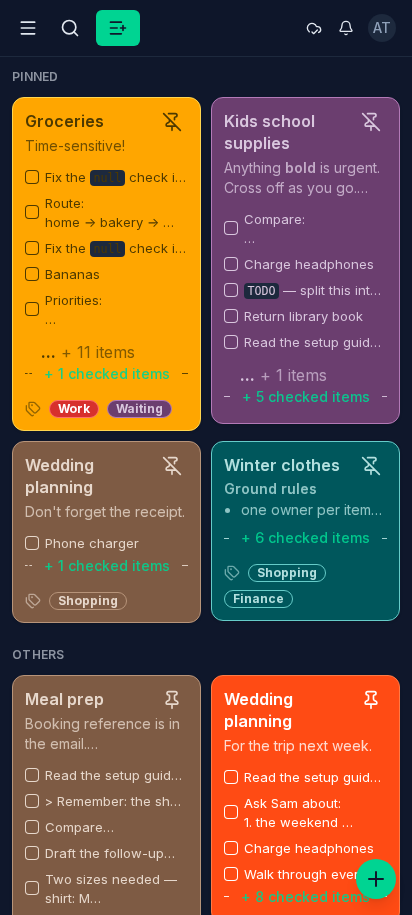

# Screenshots

A walk through CheckCheck, from the board you land on to editing a card, working
through its items, and sharing a list, on desktop and on your phone. Every screen
comes in a light and a dark theme, and the app follows whichever your system
uses. Click any image to open it full size.

## Your board

Everything you own on one board. Pinned cards sit up top, the rest follow below.
Each card is colour-coded, shows a preview of its items, and carries its labels.
The sidebar keeps your labels and shared views one click away, and the search
bar finds any card fast.

<table>
<tr>
<td width="50%"></td>
<td width="50%"></td>
</tr>
<tr>
<td align="center"><b>Light</b></td>
<td align="center"><b>Dark</b></td>
</tr>
</table>

## Opening a card

Click a card to open its editor. Add or remove items, drag the handles to
reorder them, and write a note at the top. Notes support Markdown, with a
formatting help link right there when you need it.

<table>
<tr>
<td width="50%"></td>
<td width="50%"></td>
</tr>
<tr>
<td align="center"><b>Light</b></td>
<td align="center"><b>Dark</b></td>
</tr>
</table>

## Working through items

The card menu keeps the list tidy as you go. **Separate checked items** moves
ticked things to the bottom (on by default), or turn it off to check them in
place. Two batch actions clear a full list in one step: **Untick all items** and
**Delete ticked items**.

With **Suggest existing items** on, typing the name of something you already
checked off offers to uncheck it again, instead of adding a duplicate. Handy for
a grocery list you reuse week after week.

## Sharing a list

Share a single card without opening up the rest of your board. Invite specific
people and give each one view, check, or edit rights. Share with a whole group,
so anyone who joins later gets access on their next sign-in. Or create a public
link, optionally with an expiry date and a passphrase, that anyone can open
without an account. You can also hand ownership to another collaborator.

## On your phone

The same board and editor, laid out for a small screen. Install it as a PWA and
it behaves like a native app. See [pwa-install.md](pwa-install.md) for the how-to.

<table>
<tr>
<td width="50%"></td>
<td width="50%"></td>
</tr>
<tr>
<td align="center"><b>Light</b></td>
<td align="center"><b>Dark</b></td>
</tr>
</table>
