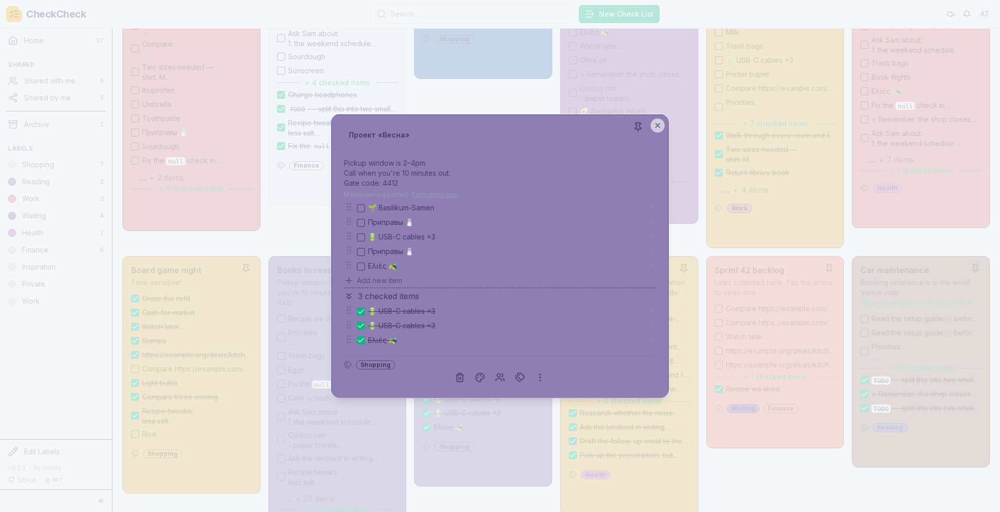
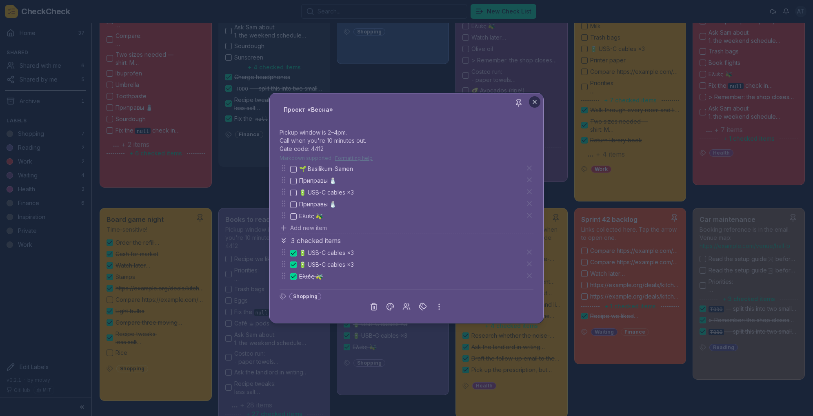

# Screenshots

A walk through CheckCheck, from the board you land on to editing a card, working
through its items, and sharing a list, on desktop and on your phone. Every screen
comes in a light and a dark theme, and the app follows whichever your system
uses. Click any image to open it full size.

## Your board

Everything you own on one board. Pinned cards sit up top, the rest follow below.
Each card is colour-coded, shows a preview of its items, and carries its labels.
The sidebar keeps your labels and shared views one click away, and the search
bar finds any card fast.

<table>
<tr>
<td width="50%"><a href="screenshots/desktopLight.png"></a></td>
<td width="50%"><a href="screenshots/desktopDark.png"></a></td>
</tr>
<tr>
<td align="center"><b>Light</b></td>
<td align="center"><b>Dark</b></td>
</tr>
</table>

## Opening a card

Click a card to open its editor. Add or remove items, drag the handles to
reorder them, and write a note at the top. Notes support Markdown, with a
formatting help link right there when you need it.

<table>
<tr>
<td width="50%"><a href="screenshots/DesktopLightEditor.png"></a></td>
<td width="50%"><a href="screenshots/DesktopDarkEditor.png"></a></td>
</tr>
<tr>
<td align="center"><b>Light</b></td>
<td align="center"><b>Dark</b></td>
</tr>
</table>

## Working through items

The card menu keeps the list tidy as you go. **Separate checked items** moves
ticked things to the bottom (on by default), or turn it off to check them in
place. Two batch actions clear a full list in one step: **Untick all items** and
**Delete ticked items**.

<a href="screenshots/DesktopCompactShowItemOptions.png"></a>

With **Suggest existing items** on, typing the name of something you already
checked off offers to uncheck it again, instead of adding a duplicate. Handy for
a grocery list you reuse week after week.

<a href="screenshots/DesktopCompactShowItemSuggestions.png"></a>

## Sharing a list

Share a single card without opening up the rest of your board. Invite specific
people and give each one view, check, or edit rights. Share with a whole group,
so anyone who joins later gets access on their next sign-in. Or create a public
link, optionally with an expiry date and a passphrase, that anyone can open
without an account. You can also hand ownership to another collaborator.

<a href="screenshots/DesktopCompactShowShareMenu.png"></a>

## On your phone

The same board and editor, laid out for a small screen. Install it as a PWA and
it behaves like a native app. See [pwa-install.md](pwa-install.md) for the how-to.

<table>
<tr>
<td width="50%"><a href="screenshots/mobileLight.png"></a></td>
<td width="50%"><a href="screenshots/mobileDark.png"></a></td>
</tr>
<tr>
<td align="center"><b>Light</b></td>
<td align="center"><b>Dark</b></td>
</tr>
</table>

The card editor fills the screen on a phone, so there is room for long items and
Markdown notes without the list feeling cramped.

<table>
<tr>
<td width="50%"><a href="screenshots/mobileLightEditor.png"></a></td>
<td width="50%"><a href="screenshots/mobileDarkEditor.png"></a></td>
</tr>
<tr>
<td align="center"><b>Light</b></td>
<td align="center"><b>Dark</b></td>
</tr>
</table>

## Regenerating these images

Every image on this page is generated from the running app by
[`gen_screenshots.sh`](../gen_screenshots.sh). Do not replace them by hand.

```bash
source build_server_dev_env.sh                       # once, for the backend venv
cd CheckCheck/frontend && bun run test:e2e:install   # once, for the browsers
cd - && ./gen_screenshots.sh
```

The script starts a throwaway Postgres container, seeds it with the
deterministic dev dataset, builds the frontend, boots a backend on port 8183,
and drives Playwright to write each PNG. Everything is torn down afterwards, and
nothing touches your dev database.

Useful flags:

| Flag | Effect |
| --- | --- |
| `--no-build` | Reuse the existing frontend build (much faster on reruns) |
| `--only menus` | Regenerate only the specs whose filename matches |
| `--headed` | Watch the browser work through the shots |

A few things are deliberately pinned, because unpinning them makes every run
produce a diff even when nothing changed:

- **The dataset.** Seed and profile live in
  `CheckCheck/backend/screenshots/start_screenshot_server.py`. Changing the
  seeder changes these images, so regenerate and review when you touch it.
- **The version stamp.** The sidebar renders the server version, which would
  otherwise be a setuptools-scm dev string. `gen_screenshots.sh` pins it via
  `SETUPTOOLS_SCM_PRETEND_VERSION`; bump that at release time.
- **The viewports.** 1992x1353 desktop and 412x915 mobile, both at DPR 1.
  Changing them reflows every image on this page.

This is a manual pre-release chore, not a CI job: the output is binary and
regenerating on every push would bloat the repository history. Run it when the
UI has visibly changed, then review `git diff --stat docs/screenshots/` before
committing.

`desktopDarkLightMix.png` is a composite rather than a screenshot: the light and
dark board shots stacked and split on a diagonal, assembled in
`compose-mix.spec.ts`. It is regenerated automatically after both board shots.

The editor shots always open the board's most content-rich card, picked by
measurement rather than by name, so they keep illustrating a real list even if
the seeder's content pool changes.
